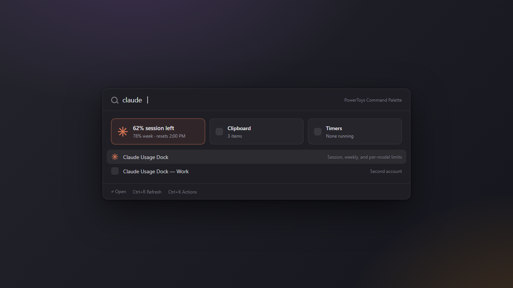
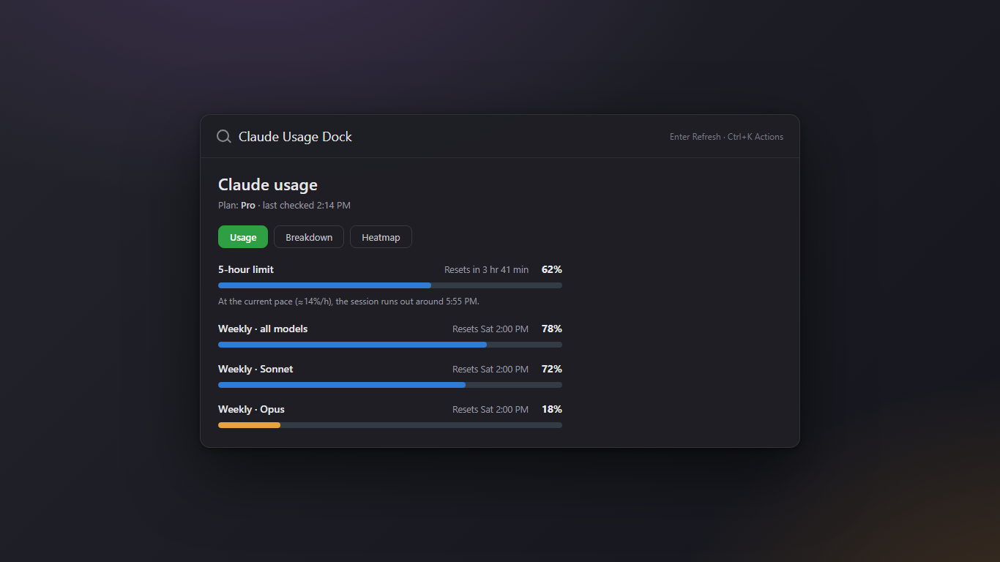
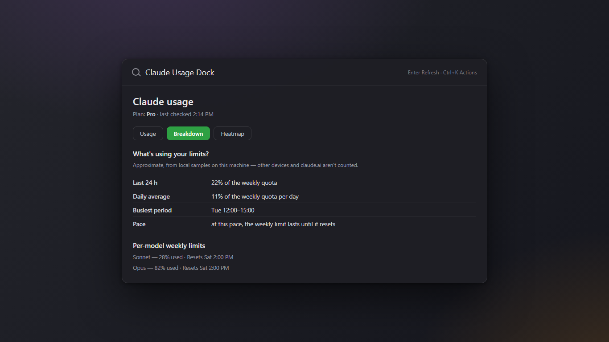
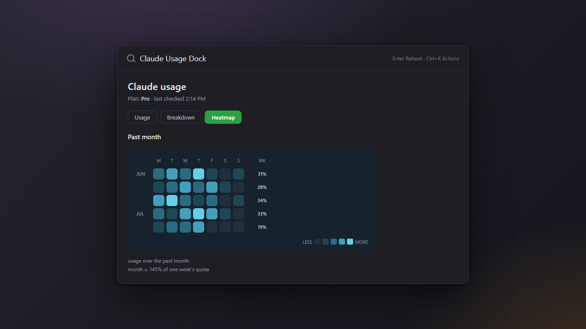

# Store screenshots

Screenshots for the Microsoft Store listing, at the Store's landscape desktop
size **1366×768** (PNG).

| File | Shows | Caption column in [../store-screenshot-captions.csv](../store-screenshot-captions.csv) |
|------|-------|--------|
| `01-dock-tile.png` | The Command Palette dock with the live Claude tile | `DockTile` |
| `02-usage.png` | Usage tab — session / weekly / per-model bars | `UsageTab` |
| `03-breakdown.png` | Breakdown tab — usage statistics | `BreakdownTab` |
| `04-heatmap.png` | Heatmap tab — monthly calendar | `HeatmapTab` |

## Preview

**Dock tile** — session and weekly usage remaining at a glance



**Usage tab** — color-coded session, weekly, and per-model bars



**Breakdown tab** — what's driving your usage



**Heatmap tab** — monthly GitHub-style calendar



## These are representative mockups

They are **not** literal OS screen captures — they're HTML renderings (`src/`)
built to match the app's real layout, dark Command Palette chrome, and exact
colors (bar fills `#2E7CD6` / `#E8A33D` / `#E74856` on track `#333B45`; heatmap
teal→cyan ramp on navy `#17222D`, straight from `BarRenderer.cs` and
`TrendChartRenderer.cs`). The numbers shown are illustrative sample data.

They accurately depict real functionality, so they're fine to submit. If you'd
rather ship pixel-exact captures of the running extension inside PowerToys,
take them from the installed build and drop them in over these — keep the same
filenames so the caption mapping still holds.

## Regenerating

Edit the HTML in `src/`, then re-render with headless Edge:

```bash
EDGE="/c/Program Files (x86)/Microsoft/Edge/Application/msedge.exe"
cd docs/store-assets
for f in 01-dock-tile 02-usage 03-breakdown 04-heatmap; do
  "$EDGE" --headless=new --disable-gpu --hide-scrollbars \
    --force-device-scale-factor=1 --allow-file-access-from-files \
    --window-size=1366,768 --screenshot="$(pwd)/${f}.png" "$(pwd)/src/${f}.html"
done
```

For a sharper 2× asset (2732×1536, also within Store limits), set
`--force-device-scale-factor=2`.

## Store requirements (as of 2026)

- At least one screenshot is required; up to 10 per language.
- Desktop size 1366×768 to 3840×2160, PNG.
- The listing can reuse one set of screenshots across all languages, or you can
  upload localized captures per language; captions are per-language either way.
